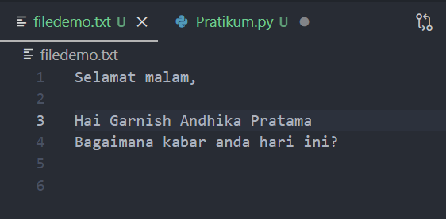

## Belajar Exception pada python
### Dengan menggunakan block try except
### Repository ini dibuat sebagai tugas Bahasa pemrogramman

1. Pertama kita buat sebuah folder bernama `Pertemuan13_pratikum9` dan didalamnya kita buat file bernama `Praktikum.py` , `filedemo.txt` dan `filedemo2.txt`, untuk penamaan folder dan file itu sesuai kesukaan kalian.

   

2. Sekarang mari kita buka file `Praktikum.py` lalu inputkan codingan sebagai berikut :

   

    ! Kita melakukan penanganan kesalahan NameError
    lalu run dengan cara ketik `python Praktikum.py` di terminal

    Maka hasilnya sebagai berikut :

   

3. Masih difile yang sama yaitu `Praktikum.py` lalu inputkan codingan sebagai berikut :

   

    ! Jangan lupa untuk mengcomment codingan sebelumnya atau kalian boleh hapus agar kita fokus di contoh kedua yaitu FileNotFoundError

    lalu run dengan cara ketik `python Praktikum.py` di terminal

    Maka hasilnya sebagai berikut :

   

4. Masih difile yang sama yaitu `Praktikum.py` lalu inputkan codingan sebagai berikut :

   

    ! Jangan lupa untuk mengcomment codingan sebelumnya atau kalian boleh hapus agar kita fokus di contoh kedua yaitu FileExistError

    lalu run dengan cara ketik `python Praktikum.py` di terminal

    Maka hasilnya sebagai berikut :

   

   disini error bahwa file tersebut sudah ada, seperti yang kita lihat filedemo2 sudah kita buat diawal. jadi kita tidak boleh membuat file dengan nama yang sama dalam satu folder

5. Masih difile yang sama yaitu `Praktikum.py` lalu inputkan codingan sebagai berikut :

   

    ! Jangan lupa untuk mengcomment codingan sebelumnya atau kalian boleh hapus agar kita fokus di contoh keempat yaitu TypeError

    lalu run dengan cara ketik `python Praktikum.py` di terminal

    Maka hasilnya sebagai berikut :

   

    Baik disini errornya berupa type yaitu bahwa nim itu harus integer, karena fungsi input selalu mengembalikan type data string, jika kalian tidak ingin eror kalian bisa convert nim trsebut ke integer dngn cara berikut => nim = int(input("Masukan NIM : "))

### Sekian Terimakasih 
### Garnish Andhika Pratama